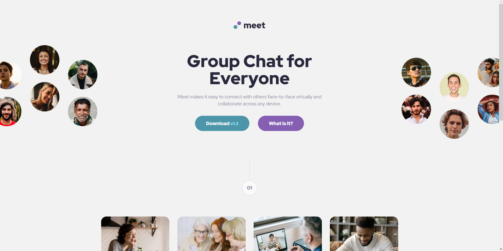
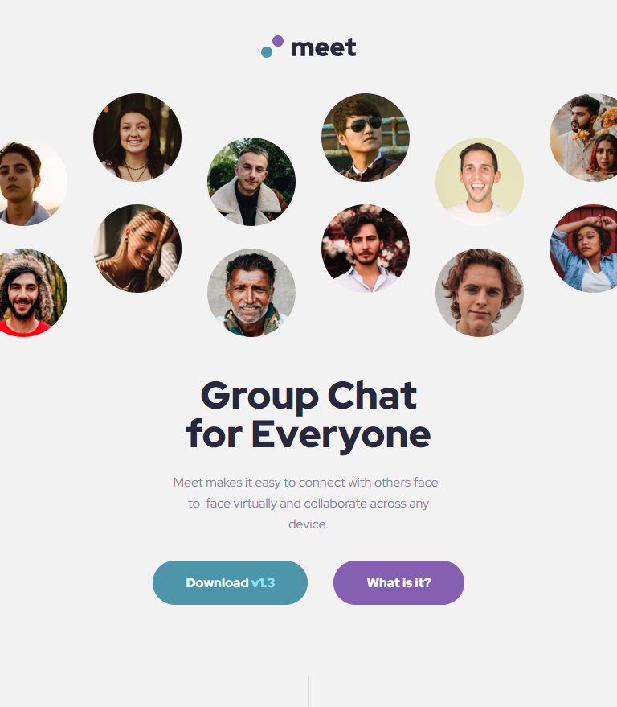
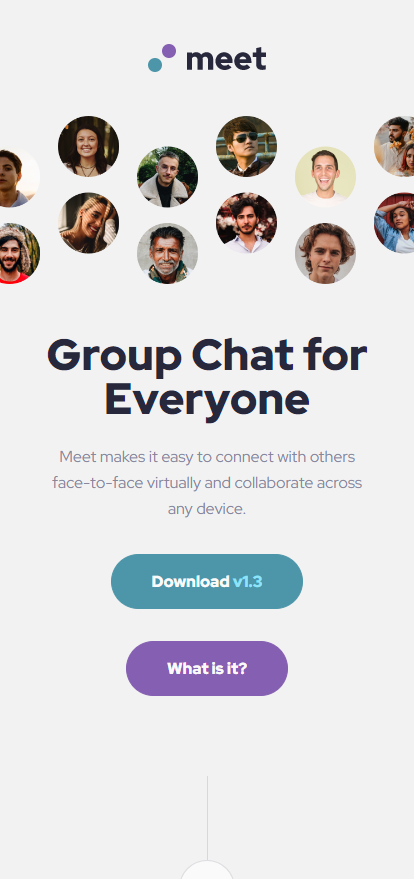

# Frontend Mentor - Meet landing page solution

This is a solution to the [Meet landing page challenge on Frontend Mentor](https://www.frontendmentor.io/challenges/meet-landing-page-rbTDS6OUR).

## Table of contents

- [Overview](#overview)
  - [The challenge](#the-challenge)
  - [Screenshot](#screenshot)
  - [Links](#links)
- [My process](#my-process)
  - [Built with](#built-with)
- [Author](#author)

## Overview

### The challenge

The challenge was to recreate the landing page based on a provided figma design. Users should be able to:

- View the optimal layout depending on their device's screen size
- See hover states for interactive elements

### Screenshot

#### Preview

#### My solution

##### Desktop:

##### Tablet:

##### Mobile:

### Links

- Solution URL: [Add solution URL here](https://github.com/joaskr/meet-landing-page)
- Live Site URL: [Add live site URL here](https://meet-landing-page-alpha-three.vercel.app)

## My process

### Built with

- Semantic HTML5 markup
- CSS
- Flexbox
- Mobile-first workflow

## Author

- Github - [@joaskr](https://github.com/joaskr)
- Frontend Mentor - [@joaskr](https://www.frontendmentor.io/profile/joaskr)

